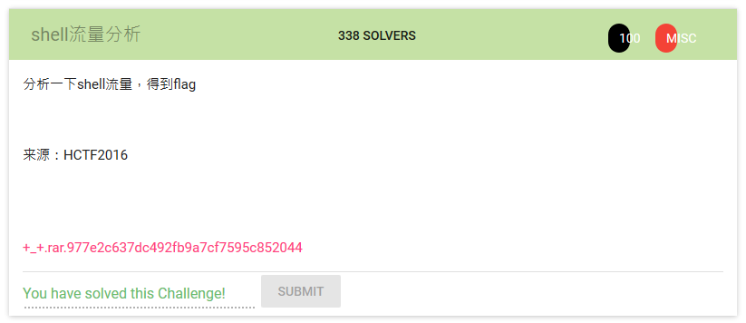

# shell流量分析

unzip the file +_+.rar.977e2c637dc492fb9a7cf7595c852044

in the unzip folder, a pcanpng file is found

by following the tcp stream (tcp.stream eq 1), we can discover two files

an encrypted flag from test/something/welcome/secret/not_important_secret/trash/flag

a python script from test/something/welcome/secret/important_secret/very_important

using the decrypt function in the script, we are able to get the decrypted flag

flag: hctf{n0w_U_w111_n0t_f1nd_me}
