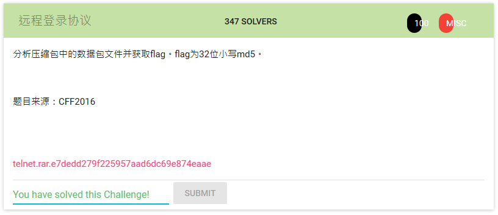
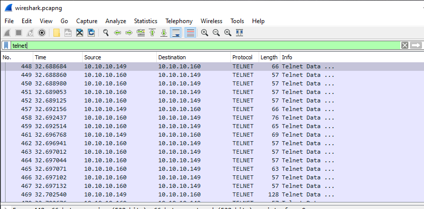
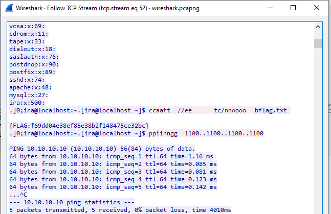

# 远程登录协议

unzip the file 

in the unzip folder, a pcanpng file is found

apply a filter to telnet protocol

by following tcp stream eq 52, we can see the flag

flag: f69dd04e38ef85e38b2f148475ce32bc