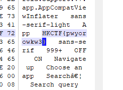

# Simple APK

Given:

A zip file named "app_release.apk.zip"

===

Unzip it and found a file named "app_release.apk"

Simply put it into winhex

Use hotkey Ctrl + F and search "HKCTF"

Flag: HKCTF{pwyorowkw3}