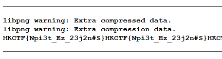

# Spider Man

Given:

Where the spider can't access, where the answer is.

Please access it on http://13.251.58.69:8003

===

The word spider reminds me the web crawler

A place that a spider can't access should be the robots.txt

Enter http://13.251.58.69:8003/robots.txt

A txt file can be downloaded

Putting it into winhex, we can observe that it has a png header

Convert the extension into png

After observing the png, it seems to be related to npiet

Using the npiet online: https://www.bertnase.de/npiet/npiet-execute.php to execute the image

A flag can be seen: HKCTF{Npi3t_Ez_23j2n#S}

 
